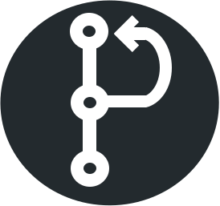

 <hr>
Pull-request is a collaboration platform that allows users to browse GitHub repositories and connect with the owner to offer assistance on their project.
 <br><br>

>"Pull-request is like a dating app-except you end up working with your matches instead of sleeping with them." - User
 
 
The app only displays projects labeled as <strong>'Help Wanted'</strong> to encourage this collaboration.


## How it works 
The UI is similar to dating app designs in that the homepage is populated with potential matches that the user interacts with via by swiping. Once the user finds a project they would like to collaborate on they send a message, or "Pull-request", to the owner. This message arrives as a comment on the GitHub repo issue page and contains a custom URL that directs the repo owner to a chat session with our original user in the Pull-request app.  
 
Once the project owner accepts the pull-request, the two users are merged and the journey can begin ❣️
 
## Dependencies and tools 🛠️
 
Pull-request utilizes the GitHub API and the ocktokit/rest api client for data. Socket.io is used to create chat sessions and Material-ui is used for design elements. 
 
### List of Pull-request's dependencies include:
* @octokit/rest
* @material-ui/core
* @material-ui/icons
* github
* express
* express-session
* mongoose
* node-sass-middleware
* passport
* passport-github
* socket.io
* react-tinder-card
* react-dom

## Interface
The app is optimized for mobile and desktop devices and is fully responsive in all formats. The interface is designed to be clean and accessible to give users an intuitive experience.

## ToDos

* Light and Dark theme settings
* Message lazy loading
* Change swipe functionality to browse back and forth in stead of removing the card
* Allow code snippets in chat
* User type - Looking for help 
* Filter options for language, tools and labels
* Notifications for chats

## Installation

You'll need to get your own Github token for authentication and, client id & password for the api.
.env file structure:
```.env
PORT=5555
ENV=development
API_SERVER_URL=http://localhost:5555
API_CLIENT_URL=http://localhost:3000
SESSION_SECRET=...
GITHUB_CLIENT_ID=...
GITHUB_CLIENT_SECRET=...
GITHUB_TOKEN=...
MONGODB_USER=...
MONGODB_PASSWORD=...
```

```npm
cd client && npm install
npm install 
npm run dev
```


## Contributing
Pull requests are welcome. For major changes, please open an issue first to discuss what you would like to change.

Please make sure to update tests as appropriate.

## Authors
[Gilad Tsabar](https://github.com/giladt) 
& [Daniel Parry](https://github.com/DanP20) 


